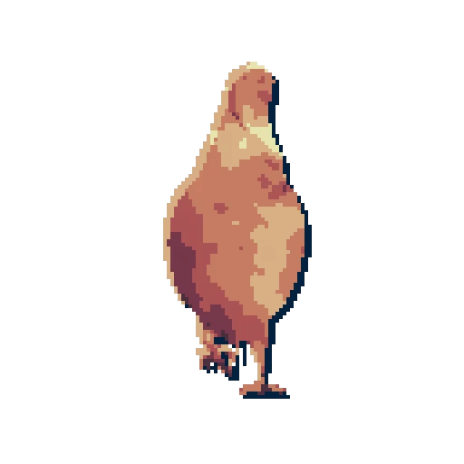

<!-- <div id="readme-main"> -->

---

<!-- <div class="title"> -->
    
<!-- ```
a pigeon
``` -->
<!-- </div> -->

<!-- <div class="center"> -->
<!--  -->
<!-- </div> -->

<!-- --- -->

<!--  -->

<!-- <div> -->
<!--  -->

<!-- --- -->

<!--  -->
<!-- </div> -->

<!-- <div class="title">
    Personal projects
</div>

### Computer graphics
<div class="layout-1">
    <div class="image" id="a"></div>
    <div class="image" id="b"></div>
    <div class="image" id="c"></div>
</div> -->

### TEST
<!-- ### 3D Art -->


<div class="layout-2">
    <div style="
        grid-area: a;
        width: 100%;
        height: 20rem;
        box-shadow: 0.5rem 0.5rem 0rem black;
        border-radius: 1rem;
        background-color: white;
        background-size: cover;
        background-position: center;
        background-repeat: no-repeat;
        background-image: url(./assets/images/cornell.jpg);">.</div>
    <div class="image" id="e"></div>
    <div class="image" id="f"></div>
    <div class="image" id="g"></div>
</div>

---

<!-- <style>
    #readme-main {
        --roundness: 1rem;
        --spacing: 2rem;
        font-family: monospace;
    }
    #readme-main .title {
        width: 100%;
        text-align: center;
        font-size: 2rem;
        font-weight: bold;
    }
    #readme-main .center {
        display: flex;
        flex-direction: column;
        align-items: center;
    }
    #readme-main .image {
        width: 100%;
        height: 100%;
        background-color: white;
        border-radius: var(--roundness);
        background-size: cover;
        background-position: center;
        background-repeat: no-repeat;
        box-shadow: 0.5rem 0.5rem 0rem black;
    }
    #readme-main .layout-1 {
        height: 40rem;
        display: grid;
        grid-template-areas: 'a b' 'c c';
        grid-template-columns: 1fr 1fr;
        grid-template-rows: 1fr 1fr;
        gap: var(--spacing);
    }
    #readme-main .layout-2 {
        height: 60rem;
        display: grid;
        grid-template-areas: 'd b' 'a b' 'c b';
        grid-template-columns: 2fr 1fr;
        grid-template-rows: 1fr 1fr 1fr;
        gap: var(--spacing);
    }
    #readme-main #a {
        grid-area: a;
        background-image: url(./assets/images/cornell.jpg);
    }
    #readme-main #b {
        grid-area: b;
        background-image: url(./assets/images/orb.jpg);
    }
    #readme-main #c {
        grid-area: c;
        background-image: url(./assets/images/fractal.jpg);
    }
    #readme-main #d {
        grid-area: d;
        background-image: url(./assets/images/robot.jpg);
    }
    #readme-main #e {
        grid-area: a;
        background-image: url(./assets/images/archviz.jpg);
    }
    #readme-main #f {
        grid-area: b;
        background-image: url(./assets/images/castle.jpg);
    }
    #readme-main #g {
        grid-area: c;
        background-image: url(./assets/images/revolver.jpg);
    }
</style> -->

<!-- </div> -->